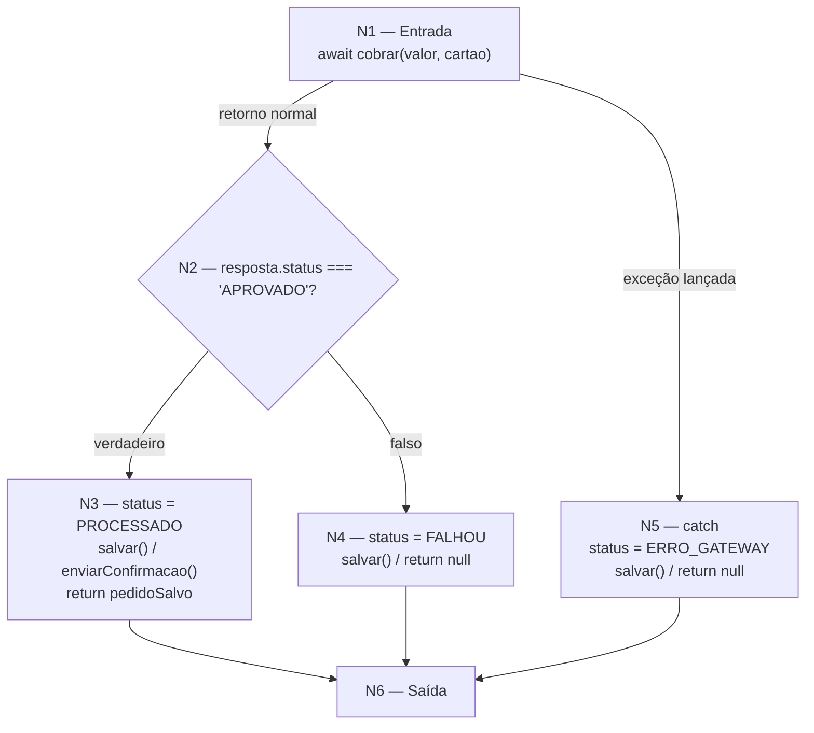

# Fase 1 — Grafo de Fluxo de Controle e Complexidade Ciclomática

**Componente auditado:** `CheckoutService.processar(pedido)` (versão legada fornecida)
**Arquivo-fonte:** `src/services/CheckoutService.js`
**Objetivo:** mapear o fluxo de controle do método principal de processamento de pedidos e calcular matematicamente o V(G) para descobrir o número mínimo de caminhos independentes que a suíte de testes precisa cobrir.

---

## 1. Código sob análise (numeração de comandos)

```js
async processar(pedido) {
  try {
    // [1] chamada externa que pode lançar exceção
    const resposta = await this.gatewayPagamento.cobrar(pedido.valor, pedido.cartao);

    if (resposta.status === 'APROVADO') {        // [2] decisão
      pedido.status = 'PROCESSADO';              // [3]
      const pedidoSalvo = await this.pedidoRepository.salvar(pedido);
      await this.emailService.enviarConfirmacao(pedido.clienteEmail, "Pagamento Aprovado");
      return pedidoSalvo;                         // [3]
    } else {
      pedido.status = 'FALHOU';                  // [4]
      await this.pedidoRepository.salvar(pedido);
      return null;                                // [4]
    }
  } catch (error) {                               // [5] desvio implícito (exceção)
    console.error("Falha catastrófica no gateway bancário:", error.message);
    pedido.status = 'ERRO_GATEWAY';
    await this.pedidoRepository.salvar(pedido);
    return null;                                  // [5]
  }
}
```

---

## 2. Grafo de Fluxo de Controle (GFC)

Nós sequenciais foram condensados em blocos. O bloco `[1]` representa a chamada
externa `cobrar(...)`, que possui **duas saídas**: retorno normal (para a decisão)
ou lançamento de exceção (para o `catch`).



### Inventário de nós e arestas

| Nó | Descrição |
| :-- | :-- |
| N1 | Entrada / chamada `cobrar()` (ponto de bifurcação sucesso × exceção) |
| N2 | Nó predicado: `resposta.status === 'APROVADO'` |
| N3 | Bloco de sucesso (PROCESSADO → salvar → e-mail → retorno) |
| N4 | Bloco de recusa de negócio (FALHOU → salvar → retorno) |
| N5 | Bloco de exceção / `catch` (ERRO_GATEWAY → salvar → retorno) |
| N6 | Saída (nó de junção / `exit`) |

| # | Aresta | Condição |
| :-- | :-- | :-- |
| a1 | N1 → N2 | `cobrar` retornou (sem exceção) |
| a2 | N1 → N5 | `cobrar` lançou exceção (timeout/erro de infra) |
| a3 | N2 → N3 | status `APROVADO` (verdadeiro) |
| a4 | N2 → N4 | status diferente de `APROVADO` (falso) |
| a5 | N3 → N6 | fim do caminho de sucesso |
| a6 | N4 → N6 | fim do caminho de recusa |
| a7 | N5 → N6 | fim do caminho de exceção |

**Nós (N) = 6 · Arestas (E) = 7 · Nós predicados (P) = 2** *(o `if` e o desvio implícito `try/catch`)*

---

## 3. Cálculo da Complexidade Ciclomática V(G)

O valor é confirmado pelas três fórmulas equivalentes de McCabe:

| Método | Fórmula | Cálculo | Resultado |
| :-- | :-- | :-- | :-- |
| Arestas e nós | `V(G) = E − N + 2` | `7 − 6 + 2` | **3** |
| Nós predicados | `V(G) = P + 1` | `2 + 1` | **3** |
| Regiões do grafo | regiões fechadas + região externa | `2 + 1` | **3** |

> **V(G) = 3** → são necessários **no mínimo 3 caminhos independentes** (caminhos-base)
> para cobrir estruturalmente o método legado.

---

## 4. Conjunto de Caminhos-Base (Basis Paths)

| Caminho | Sequência de nós | Cenário equivalente | Status final |
| :-- | :-- | :-- | :-- |
| **CB1** | N1 → N2 → N3 → N6 | Pagamento aprovado (caminho feliz) | `PROCESSADO` |
| **CB2** | N1 → N2 → N4 → N6 | Cartão recusado (falha de negócio) | `FALHOU` |
| **CB3** | N1 → N5 → N6 | Exceção do gateway (falha de infraestrutura) | `ERRO_GATEWAY` |

Cada caminho-base vira, no mínimo, **um caso de teste obrigatório** e um cenário
Gherkin correspondente (ver `features/checkout.feature`).

---

## 5. Observação para a estimativa (legado × redesenho)

O V(G) = 3 reflete o **código legado**, que é frágil justamente por sua baixa
complexidade: ele **não trata** timeout (RN04), retentativas (RN05), backoff (RN06)
nem circuit breaker (RN07) descritos no DER (`docs/especificacao.md`).

Ao redesenhar o componente na Fase 2 com essas políticas de resiliência, a
complexidade ciclomática-alvo sobe para a faixa de **V(G) ≈ 7–9** (laço de retry,
verificação de tipo de erro, estado do disjuntor e validações de entrada). Esse
crescimento é esperado e desejável — ele é dimensionado no documento de estimativa
de esforço (`estimativa-de-esforco.md`) para que a cobertura de caminhos e o
Mutation Score ≥ 90% sejam atingíveis.
